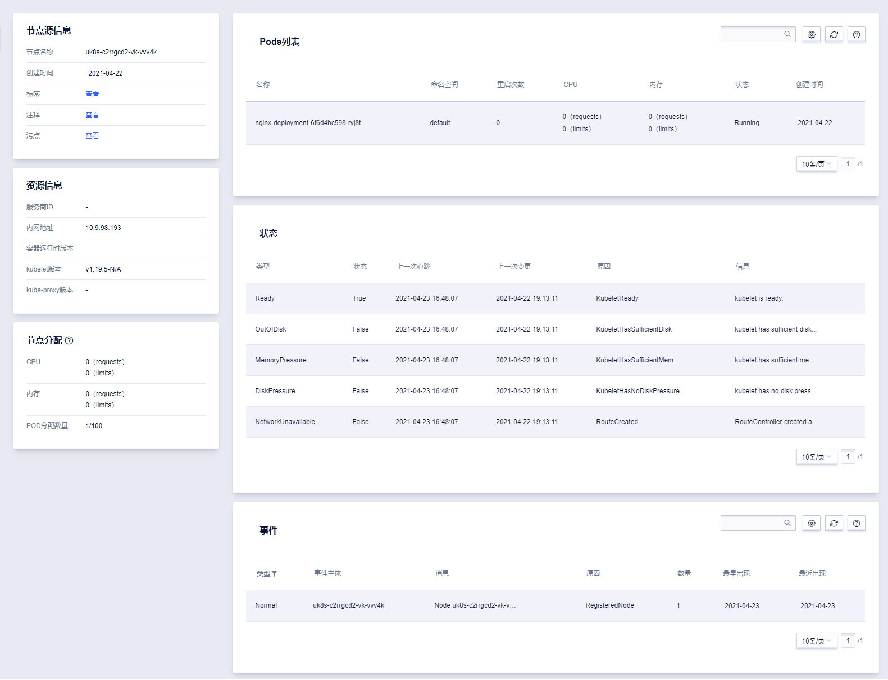

# Virtual Kubelet 虚拟节点


[Virtual Kubelet](https://virtual-kubelet.io/) 是 Kubernetes 社区的重要开源项目，基于 Virtual Kubelet 虚拟节点组件，可以实现 UCloud 两大容器产品 UK8S 和 Cube 的无缝对接，用户在 UK8S 集群中可通过 VK 组件创建 [Cube 容器实例](/cube/README)，每个 Cube 实例被视为虚拟节点上的一个Pod。

## 1. 添加虚拟节点

在集群节点列表页，点击「添加虚拟节点」按钮，为 UK8S 集群添加虚拟节点，当前一个 UK8S 集群支持最多添加 8 个虚拟节点，所添加的虚拟节点名称为 **uk8s-xxxxxxxx-vk-xxxxx**，该名称将被注册为虚拟节点的 **spec.nodeName**，其中 **uk8s-xxxxxxxx** 为 UK8S 集群 ID，末五位为随机生成的数字字母组合。

如您使用的是 [UK8S 托管版集群](uk8s/userguide/createcluster)，在添加虚拟节点前，需要集群中至少有一个 Node 节点。


| 字段 | 说明 |
|-----|-------|
|地域|虚拟节点所属地域，即 UK8S 集群所在地域，不可更改。|
|所属子网|虚拟节点及生成的 Cube Pod 所在子网，默认为 UK8S 集群 Master 节点所在子网。|
|可用区|虚拟节点及生成的 Cube Pod 所在可用区，<br>当前 Cube 支持可用区：华北（北京）B/E，上海二A，广州B，香港B，东京A。|
|Pod 默认配置|不指定资源 requests 情况下，虚拟节点生成的 Cube Pod 中单个 Container 的默认资源配置。|
|节点最大 Pod 数|节点最大可以创建的 Cube Pod 数量，当前支持最多 200 个 Cube Pod。|
|Cluster IP 支持|虚拟节点生成的 Cube Pod 可与 UK8S 中 Pod 通过 Cluster IP 互相访问。<br>当 Cube 急剧扩容时，开启该功能会导致 UK8S ApiServer 压力急剧上升。对无需使用 K8S Service 转发能力的容器，建议不开启该功能。|

## 2. 虚拟节点管理

### 2.1 节点描述

虚拟节点与普通 Node 节点一样，是 UK8S 集群当中的一个 Node 对象。[命令行管理时](/uk8s/manageviakubectl/intro_of_kubectl)可使用 `kubectl get nodes` 等命令进行节点的管理、查看，在集群列表页点击「节点描述」按钮，亦可查看虚拟节点详细信息、节点状态、节点生成的 Cube Pod 及节点事件。



### 2.2 禁用及删除

您可以在控制台页面，进行虚拟节点的禁用和删除，禁用虚拟节点后应用将不能够通过虚拟节点创建 Cube 实例，现有通过虚拟节点创建的 Cube 实例将被保留。删除虚拟节点时，通过虚拟节点创建的 Cube 实例及所挂载的UDisk 将会被默认删除。

### 2.3 虚拟节点升级

在 UK8S 集群控制台管理页面「插件-虚拟节点」页面，开启虚拟节点升级功能。开启虚拟节点升级功能会在您的集群中执⾏虚拟节点查询任务，⼤约需要 1 分钟，在此过程中请不要进行虚拟节点的增删改查操作。升级功能开启后，即可看到虚拟节点版本信息，点击**升级**即可进行升级。

升级过程约需要 1 分钟，升级过程中「当前版本」字段会显示为「升级中」，升级完成后显示最新版本号，如升级失败，请与我们技术支持联系。

支持单节点和批量升级，建议先升级单台节点，如果升级成功，则再进行批量升级。当所有节点都升级成功后，可关闭插件升级服务，后续有升级需求时再开启。

> ⚠️ 虚拟节点升级时，请勿通过虚拟节点进行实例创建、修改等工作。

### 2.4 虚拟节点版本说明

|版本|更新时间|更新内容|
|----|----|----|
|**21.09.1**|2021.09.13|支持 NFS 存储<br>支持通过 `kubectl logs` 查看 Cube Pod 日志|
|**21.08.1**|2021.08.05|支持 exec 探针|
|**21.07.1**|2021.07.14|支持以 PVC 形式使用 UDisk|
|**21.06.1**|2021.06.24|支持通过 VK 创建 Cube 时绑定 EIP|
|**21.04.1**|2021.04.29|初始版本|

## 3. 通过虚拟节点创建 Cube 实例

### 3.1 创建 Cube 实例

通过虚拟节点创建 Cube 实例的方式，与普通 Pod 资源类似，但需要在 yaml 文件 Pod spec 中添加 nodeName 或 nodeSelector 指定虚拟节点并添加污点容忍。支持直接创建 Pod，或通过 Deployment 及 StatefulSet 等控制器进行 Pod 的管理。

```yaml
# 通过指定 nodeName 调度到虚拟节点
nodeName: uk8s-xxxxxxxx-vk-xxxxx           
# 通过 nodeSelector 调度到虚拟节点，nodeName 及 nodeSelector 只需配置一项
# 如以 Deploy 及 Sts 形式创建，请务必使用 nodeSelector
# 虚拟节点创建后，也可为虚拟节点添加指定标签，用于 Pod 调度的管理
nodeSelector:
  type: virtual-kubelet                    
# 添加节点容忍
tolerations:                               
- effect: NoSchedule
  key: virtual-kubelet.io/provider
  operator: Equal
  value: ucloud
```
创建 Cube 实例时，需注意特定 CPU / 内存规格有一定的比例及限制，单个 Container 的规格配置如下：

| CPU | 内存 |
|-----|-----|
|500m|512Mi/1Gi/2Gi|
|1|1Gi/2Gi/4Gi|
|2|2Gi/4Gi/8Gi|
|4|4Gi/8Gi/16Gi|
|8|8Gi/16Gi/32Gi|
|16|16Gi/32Gi/64Gi|
|32|32Gi/64Gi|

单个 Cube 实例所有 Container 资源总和上限为 32C64G。

### 3.2 详细注释说明

通过 VK 插件创建 Cube 时，支持在 Pod annotations，或 Deployment / Statefulset 的 spec.template.annotations 中添加相应字段，为 Cube 进行进一步配置，相应注释说明如下：

| 注释 | 参数类型 | 注释说明 | 默认值 |
| ------ | ------ | ------ | ------ |
| cube.ucloud.cn/cube-tag | string | 需要指定的业务组的名称 | / |
| cube.ucloud.cn/cube-chargetype | year/month/postpay | Cube 付费模式，即按年预付费 / 按月预付费 / 按秒后付费，请参照[计费说明](/cube/introduction/charge) | postpay |
| cube.ucloud.cn/cube-quantity | int | Cube 付费时长，月付时，此参数传 0，代表购买至月末 | 1 | 
| cube.ucloud.cn/cube-eip | true/false | 是否需要绑定 EIP | false | 
| cube.ucloud.cn/cube-eip-id | eip-xxxxxxxx | 绑定指定 ID 的 EIP | /，仅在 cube.ucloud.cn/cube-eip: "true" 时生效，<br>如该项留空，则创建新的 EIP | 
| cube.ucloud.cn/cube-eip-paymode | traffic/bandwidth/sharebandwidth | EIP 计费模式，即流量计费 / 带宽计费 / 共享带宽模式 | bandwidth | 
| cube.ucloud.cn/cube-eip-share-bandwidth-id | bwshare-xxxxxx | 共享带宽 ID，仅在 EIP 计费模式为「共享带宽」时生效 | / | 
| cube.ucloud.cn/cube-eip-bandwidth | int | 绑定 EIP 的外网带宽大小，共享带宽模式必须指定 0 | 2 | 
| cube.ucloud.cn/cube-eip-chargetype | year/month/dynamic | EIP 付费模式，即按年预付费 / 按月预付费 / 按时后付费 | 取 cube.ucloud.cn/cube-chargetype 值；<br>该项为 postpay 时取 dynamic | 
| cube.ucloud.cn/cube-eip-quantity | int | EIP 付费时长 | 取 cube.ucloud.cn/cube-quantity 值 | 
| cube.ucloud.cn/cube-eip-release | true/false | 删除 Cube 实例时是否需要释放绑定的 EIP | true | 
| cube.ucloud.cn/cube-eip-security-group-id | firewall-xxxxxxxx | 需要绑定的外网防火墙策略，不指定时绑定项目默认防火墙 |/ | 

> 如需使用绑定 EIP 功能，请先确认您的 VK 插件为 21.06.1 及以上版本

## 4. 存储卷挂载支持

### 4.1 NFS 挂载支持

> 如需使用 UDisk 存储卷功能，请先确认您的 VK 插件为 21.09.1 及以上版本

#### 4.1.1 直接使用 NFS 类型 Volume

通过 VK 创建 Cube 实例时，可以像单独创建 Cube 实例时一样，直接使用 NFS 类型 Volume，以下是直接使用NFS类型Volume的示例，Cube 中 NFS 的使用详见[在 Cube 中使用 UFS](/cube/volume/ufs)

```yaml
apiVersion: v1
kind: Pod
metadata:
  name: vknfs
spec:
  tolerations:                               
  - effect: NoSchedule
    key: virtual-kubelet.io/provider
    operator: Equal
    value: ucloud
  nodeSelector:
    type: virtual-kubelet
  containers:
  - name: nginx
    image: uhub.service.ucloud.cn/ucloud/nginx:latest
    volumeMounts:
      - mountPath: "/data/" # 容器挂载路径
        name: mynfs
  volumes:
  - name: mynfs
    nfs:
      server: 10.10.112.139 # NFS 挂载地址
      path: /
```

#### 4.1.2 通过 PV、PVC 的方式引用挂载

通过 VK 创建 Cube 实例，也支持通过 PV、PVC 的方式引用挂载，PV 里可以设置详细的挂载参数，存储类、持久卷声明用法与正常在 UK8S 中使用存储卷一致，详见[在 UK8S 中使用 UFS](/uk8s/volume/ufs)

以下是使用例子：

```yaml
## 创建持久化存储卷 PV
apiVersion: v1
kind: PersistentVolume
metadata:
  name: ufspv4
spec:
  capacity:
    storage: 10Gi
  accessModes:
    - ReadWriteMany
  persistentVolumeReclaimPolicy: Retain
  nfs:
    server: 10.10.112.139 ## NFS 挂载地址
    path: /
  mountOptions: # 挂载参数配置
    - nolock
    - nfsvers=4.0 
---
## 创建持久化存储卷声明 PVC
apiVersion: v1
kind: PersistentVolumeClaim
metadata:
  name: ufsclaim
spec:
  accessModes:
  - ReadWriteMany
  resources:
    requests:
      storage: 8Gi
---
## 在 Pod 中使用 PVC
apiVersion: v1
kind: Pod
metadata:
  name: vknfs
spec:
  tolerations:                               
  - effect: NoSchedule
    key: virtual-kubelet.io/provider
    operator: Equal
    value: ucloud
  nodeSelector:
    type: virtual-kubelet
  containers:
  - name: nginx
    image: uhub.service.ucloud.cn/ucloud/nginx:latest
    volumeMounts:
      - mountPath: "/data/"
        name: mynfs
  volumes:
  - name: mynfs
    persistentVolumeClaim:
      claimName: ufsclaim
---
```

### 4.2 UDisk 存储卷挂载支持

> 如需使用 UDisk 存储卷功能，请先确认您的 VK 插件为 21.07.1 及以上版本

用户可以通过声明 PVC 存储卷的方式为虚拟节点上的 Cube 实例创建挂载 UDisk 存储卷，这部分工作由 CSI UDisk 和 Virtual Kubelet 组件共同完成，存储类、持久卷声明用法与正常在 UK8S 中使用存储卷一致（**包括新建 UDisk 及使用已有 UDisk**，详见：[在 UK8S 中使用 UDisk](/uk8s/volume/udisk)）。

以下是使用例子：

```yaml
## 创建存储类 StorageClass
apiVersion: storage.k8s.io/v1
kind: StorageClass
metadata:
  name: ssd-csi-udisk
provisioner: udisk.csi.ucloud.cn
parameters:
## 建议使用 SSD 或 SATA 云盘，避免因 RSSD 云盘 RDMA 区域与 Cube 无法匹配导致云盘无法挂载
  type: "ssd"
## 不支持 xfs 文件系统
  fsType: "ext4"
## 回收策略，支持Delete和Retain，默认为Delete，非必填
reclaimPolicy: Delete
## 如绑定模式设置为 WaitForFirstConsumer，则只能通过 pod.spec.nodeSelector 指定虚拟节点
volumeBindingMode: WaitForFirstConsumer
---
## 创建持久化存储卷声明 PVC
## 不支持 Volume Expansion（存储卷动态扩容）
kind: PersistentVolumeClaim
apiVersion: v1
metadata:
  name: logdisk-claim
spec:
  accessModes:
    - ReadWriteOnce
  storageClassName: ssd-csi-udisk
  resources:
    requests:
      storage: 20Gi
---
## 在 Pod 中使用 PVC
apiVersion: v1
kind: Pod
metadata:
  name: nginx
spec:
  tolerations:                               
  - effect: NoSchedule
    key: virtual-kubelet.io/provider
    operator: Equal
    value: ucloud
## 如绑定模式设置为 WaitForFirstConsumer，则只能通过 pod.spec.nodeSelector 指定虚拟节点
  nodeSelector:
    type: virtual-kubelet
  containers:
  - name: nginx
    image: uhub.service.ucloud.cn/ucloud/nginx:latest
    volumeMounts:
    - name: log
      mountPath: /data
  volumes:
  - name: log
    persistentVolumeClaim:
      claimName: logdisk-claim
```

