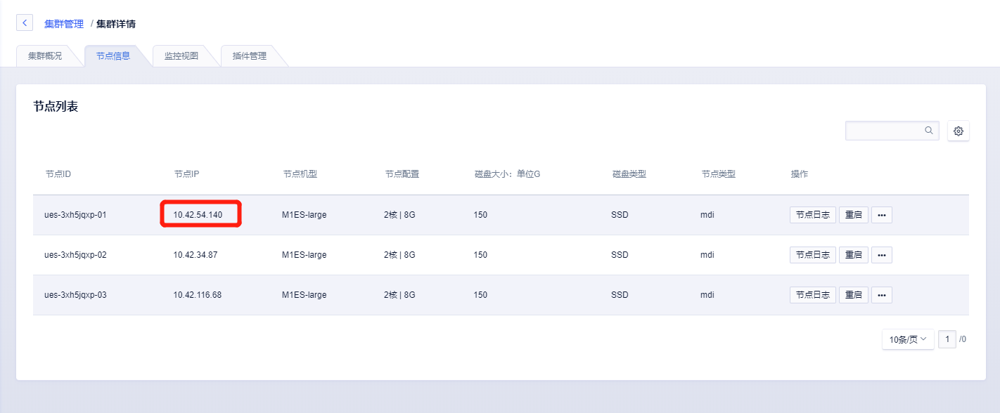
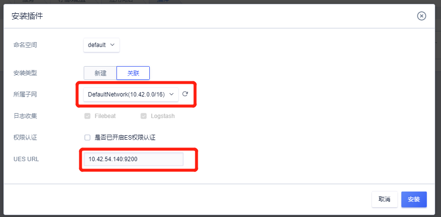
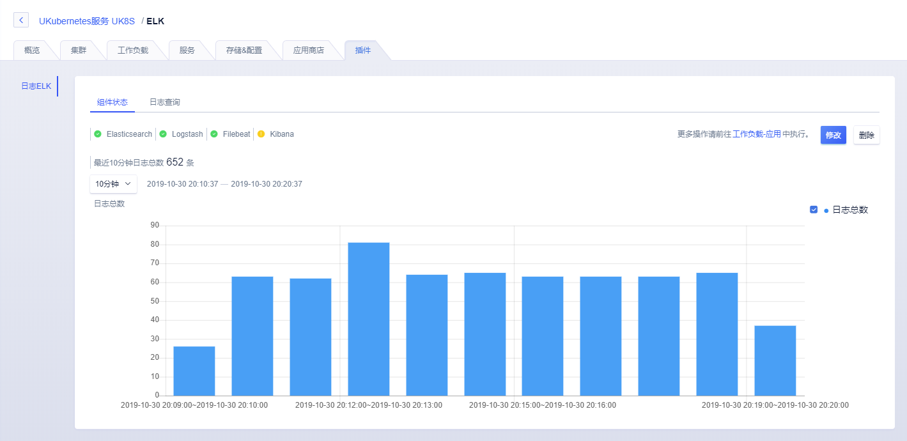

## 使用UK8S日志插件功能

UK8S推出了一个新的插件功能，旨在帮助用户快速部署UK8S集群所需要的相关插件。

### ELK日志插件

**插件-日志ELK**是UK8S提供的一键部署ELK日志组件的功能，包括FileBeat、Logstash、Kibana(可选)、Elasticsearch(可选)等组件，实现日志的自动采集、存储、查询，安装过程可能持续10分钟左右。

关于ELK组件介绍请参考[ELK日志解决方案](./elastic_filebeat_kibana_solution.md)

用户进入集群后可以选择为集群安装完整的一套ELK组件或者安装Filebeat等组件关联用户所使用的UES，通过UK8S插件部署的完整ELK组件可以在UCloud页面进行统一化日志查询展示。

### 使用须知

限制使用版本：1.14及以上

集群创建时间：2019年9月11日之后创建

如您是9月11日之前创建的1.14版本集群，请升级集群CSI后，可以使用该功能。

### 安装完整ELK日志组件

1. 用户在插件页中，点击安装插件进行选择完整安装ELK，在安装过程中用户可以对以下选项进行选择。

    可选项：

    * Elasticsearch
    这里Elasticsearch我们选择新建，将在UK8S集群中进行Elasticsearch的部署，选择关联则是进行外挂ES（UES）进行关联，这里我们默认进行集群内安装。

    * Kibana
    用户可以根据自己的需要进行安装Kibana的安装，安装后将可以通过应用中查看对外暴露的Kibana进行日志查看，提供了EIP和Ingress两种方式对外暴露，如集群内部没有安装Ingress Controller服务的话Ingress方式将无法正常提供外部访问。用户可以不进行安装在UCloud控制台进行日志查看，这里我们默认选择安装。

> 注意：请确保集群中Node节点大于3台，并有足够资源进行安装ELK服务。

2. 点击安装，进入安装页面，可以动过**鼠标悬停**查看安装状态，或者进入**工作负载-应用**中查看安装状态，安装可能将持续10分钟左右。

3. 安装完成后可以在控制台看到日志仪表盘，查看组件健康状态、日志信息统计。

4. 点击日志查询tab页可以进行日志查询，提供了具体的容器选择、时间区间和关键字等检索方式，方便用户进行日志查询。

### 关联UES安装

1. UES是UCloud提供的高可用Elasticsearch集群，使用UK8S关联UES前请创建UES服务，详情请参考[UES操作文档](https://docs.ucloud.cn/analysis/ues/index)，这里我们建立好了一个UES集群，在UES集群详情中的节点信息，选择任意一节点，记录节点IP地址。

2. 用户在插件页中，点击安装插件进行选择关联UES安装ELK，在安装过程中用户可以对以下选项进行选择。

> 注意：UES需要与UK8S集群属于同一个子网内，用户安装时需要选择具体子网，填写第一步选择节点的IP地址加9200端口号。

3. 安装完成后可以在UK8S中进行集群内部日志查询，UES集群其他日志查询请至UES集群提供的Kibana进行查询。

